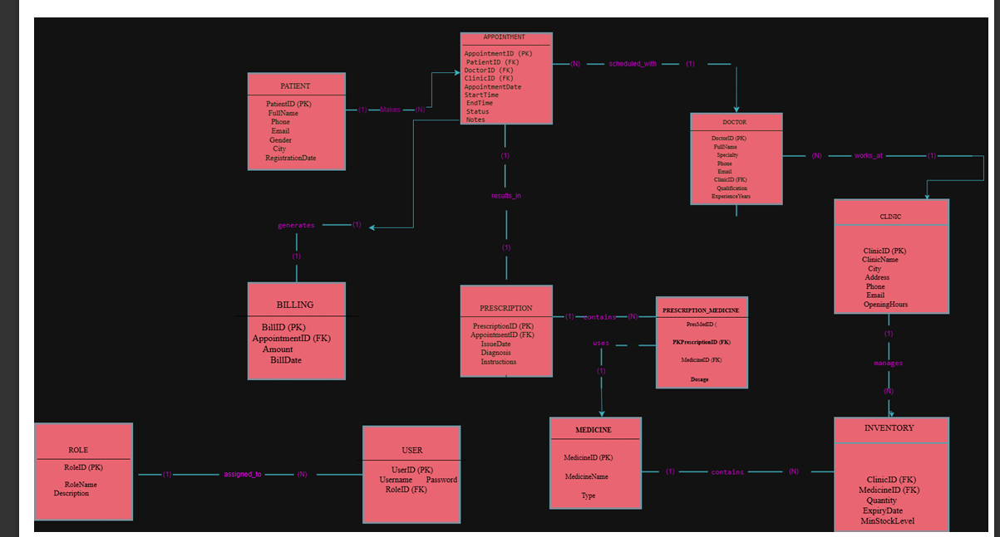

# Smart Healthcare Database System

## Project Description
This project presents a database system for a smart healthcare clinic network operating across multiple cities. 
The system manages patients, appointments, doctors, prescriptions, billing, and inventory, supporting analytics and reporting.

## Authors
- Arwa Alyami
> Developed as part of a team of 3 students.

## Project Files
- `database.sql` → Database schema and sample data
- `Project_Report.pdf` → Full project documentation  
- `ERD.png` → Entity-Relationship Diagram

## ER Diagram

## How to Run
1. Open MySQL or any SQL environment  
2. Import the `database.sql` file  
3. Run the SQL queries to test the system
