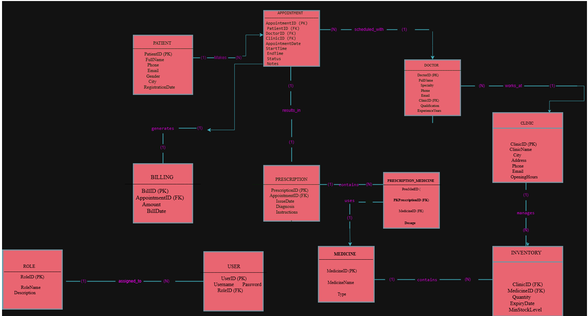

# Smart Healthcare Database System

## Overview
This project presents a database system for a smart healthcare clinic network operating across multiple cities. The system manages patients, appointments, doctors, prescriptions, billing, and inventory, supporting analytics, reporting, and role-based access control.

## Features
- Manage patient registrations and appointments
- Track doctor schedules and specialties
- Issue and manage electronic prescriptions
- Handle billing and revenue reporting per clinic
- Manage medical inventory with stock alerts
- Role-based access and data security
- Support analytics and reporting

## Technologies Used
- MySQL / SQL
- Database Design (ER Modeling)
- Normalization (1NF, 2NF, 3NF)
- Queries and Reports

## Key Concepts Applied
- Conceptual Schema Design (ER Diagram)
- Normalization and mapping to relational tables
- SQL table creation, data insertion, and query execution
- Role-based access and security protocols
- Reporting and analytics queries

## Project Report
The project report contains detailed explanations, screenshots, and SQL code.  
You can download the full report here:  
[Download Smart Healthcare Project Report](SmartHealthcareDatabase_Report.pdf)

## Project Files
- Database SQL file: [database.sql](database.sql)  
- ER Diagram: [ER_Diagram.png](ER_Diagram.png)  
- Screenshots included in the project report

## Sample ER Diagram

## How to Run
1. Clone or download the project from GitHub:  
   [Smart Healthcare Database System Repository](https://github.com/ArwaaaAli/Smart-Healthcare-Database-System)
2. Open MySQL or any SQL environment
3. Import the `database.sql` file
4. Run the SQL queries to test the system

## Author
**Arwa Alyami**  
Developed as part of a university group project (3 students)
